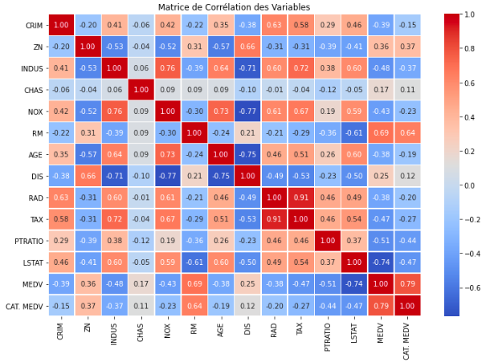

# BostonHousing
prédiciton du prix des maisons dans la ville de Boston en Fonction de leurs prix le nombre de chambres la criminaliter etc...

# Dataset

<table border="1" class="dataframe">
  <thead>
    <tr style="text-align: right;">
      <th></th>
      <th>CRIM</th>
      <th>ZN</th>
      <th>INDUS</th>
      <th>CHAS</th>
      <th>NOX</th>
      <th>RM</th>
      <th>AGE</th>
      <th>DIS</th>
      <th>RAD</th>
      <th>TAX</th>
      <th>PTRATIO</th>
      <th>LSTAT</th>
      <th>MEDV</th>
      <th>CAT. MEDV</th>
    </tr>
  </thead>
  <tbody>
    <tr>
      <th>0</th>
      <td>0.00632</td>
      <td>18.0</td>
      <td>2.31</td>
      <td>0</td>
      <td>0.538</td>
      <td>6.575</td>
      <td>65.2</td>
      <td>4.0900</td>
      <td>1</td>
      <td>296</td>
      <td>15.3</td>
      <td>4.98</td>
      <td>24.0</td>
      <td>0</td>
    </tr>
    <tr>
      <th>1</th>
      <td>0.02731</td>
      <td>0.0</td>
      <td>7.07</td>
      <td>0</td>
      <td>0.469</td>
      <td>6.421</td>
      <td>78.9</td>
      <td>4.9671</td>
      <td>2</td>
      <td>242</td>
      <td>17.8</td>
      <td>9.14</td>
      <td>21.6</td>
      <td>0</td>
    </tr>
    <tr>
      <th>2</th>
      <td>0.02729</td>
      <td>0.0</td>
      <td>7.07</td>
      <td>0</td>
      <td>0.469</td>
      <td>7.185</td>
      <td>61.1</td>
      <td>4.9671</td>
      <td>2</td>
      <td>242</td>
      <td>17.8</td>
      <td>4.03</td>
      <td>34.7</td>
      <td>1</td>
    </tr>
    <tr>
      <th>3</th>
      <td>0.03237</td>
      <td>0.0</td>
      <td>2.18</td>
      <td>0</td>
      <td>0.458</td>
      <td>6.998</td>
      <td>45.8</td>
      <td>6.0622</td>
      <td>3</td>
      <td>222</td>
      <td>18.7</td>
      <td>2.94</td>
      <td>33.4</td>
      <td>1</td>
    </tr>
    <tr>
      <th>4</th>
      <td>0.06905</td>
      <td>0.0</td>
      <td>2.18</td>
      <td>0</td>
      <td>0.458</td>
      <td>7.147</td>
      <td>54.2</td>
      <td>6.0622</td>
      <td>3</td>
      <td>222</td>
      <td>18.7</td>
      <td>5.33</td>
      <td>36.2</td>
      <td>1</td>
    </tr>
    <tr>
      <th>...</th>
      <td>...</td>
      <td>...</td>
      <td>...</td>
      <td>...</td>
      <td>...</td>
      <td>...</td>
      <td>...</td>
      <td>...</td>
      <td>...</td>
      <td>...</td>
      <td>...</td>
      <td>...</td>
      <td>...</td>
      <td>...</td>
    </tr>
    <tr>
      <th>501</th>
      <td>0.06263</td>
      <td>0.0</td>
      <td>11.93</td>
      <td>0</td>
      <td>0.573</td>
      <td>6.593</td>
      <td>69.1</td>
      <td>2.4786</td>
      <td>1</td>
      <td>273</td>
      <td>21.0</td>
      <td>9.67</td>
      <td>22.4</td>
      <td>0</td>
    </tr>
    <tr>
      <th>502</th>
      <td>0.04527</td>
      <td>0.0</td>
      <td>11.93</td>
      <td>0</td>
      <td>0.573</td>
      <td>6.120</td>
      <td>76.7</td>
      <td>2.2875</td>
      <td>1</td>
      <td>273</td>
      <td>21.0</td>
      <td>9.08</td>
      <td>20.6</td>
      <td>0</td>
    </tr>
    <tr>
      <th>503</th>
      <td>0.06076</td>
      <td>0.0</td>
      <td>11.93</td>
      <td>0</td>
      <td>0.573</td>
      <td>6.976</td>
      <td>91.0</td>
      <td>2.1675</td>
      <td>1</td>
      <td>273</td>
      <td>21.0</td>
      <td>5.64</td>
      <td>23.9</td>
      <td>0</td>
    </tr>
    <tr>
      <th>504</th>
      <td>0.10959</td>
      <td>0.0</td>
      <td>11.93</td>
      <td>0</td>
      <td>0.573</td>
      <td>6.794</td>
      <td>89.3</td>
      <td>2.3889</td>
      <td>1</td>
      <td>273</td>
      <td>21.0</td>
      <td>6.48</td>
      <td>22.0</td>
      <td>0</td>
    </tr>
    <tr>
      <th>505</th>
      <td>0.04741</td>
      <td>0.0</td>
      <td>11.93</td>
      <td>0</td>
      <td>0.573</td>
      <td>6.030</td>
      <td>80.8</td>
      <td>2.5050</td>
      <td>1</td>
      <td>273</td>
      <td>21.0</td>
      <td>7.88</td>
      <td>11.9</td>
      <td>0</td>
    </tr>
  </tbody>
</table>

506 rows × 14 columns

## Description
Le fichier ./Data/BostonHousing.csv contient des données sur les logements dans la région de Boston. 

Voici les noms des colonnes et leur signification en français :

CRIM : Taux de criminalité par habitant.
ZN : Proportion de terrains résidentiels zonés pour des lots de plus de 25 000 pieds carrés.
INDUS : Proportion de la surface occupée par des activités non commerciales.
CHAS : Variable fictive indiquant si le tracé longe la rivière Charles (1) ou non (0).
NOX : Concentration en oxydes d'azote (parties par 10 millions).
RM : Nombre moyen de pièces par logement.
AGE : Proportion de logements construits avant 1940.
DIS : Distance pondérée aux cinq principaux centres d'emploi de Boston.
RAD : Indice d'accessibilité aux autoroutes radiales.
TAX : Taux d'imposition foncière par 10 000 dollars.
PTRATIO : Ratio élèves/enseignant par ville.
LSTAT : Pourcentage de la population d'origine étrangère.
MEDV : Valeur médiane des logements occupés par leur propriétaire (en milliers de dollars).
CAT. MEDV : Variable catégorielle indiquant si la valeur médiane est supérieure à 30 000 dollars (1) ou non (0).

## 1. Chargement et Exploration des Données

<table border="1" class="dataframe">
  <thead>
    <tr style="text-align: right;">
      <th></th>
      <th>CRIM</th>
      <th>ZN</th>
      <th>INDUS</th>
      <th>CHAS</th>
      <th>NOX</th>
      <th>RM</th>
      <th>AGE</th>
      <th>DIS</th>
      <th>RAD</th>
      <th>TAX</th>
      <th>PTRATIO</th>
      <th>LSTAT</th>
      <th>MEDV</th>
      <th>CAT. MEDV</th>
    </tr>
  </thead>
  <tbody>
    <tr>
      <th>0</th>
      <td>0.00632</td>
      <td>18.0</td>
      <td>2.31</td>
      <td>0</td>
      <td>0.538</td>
      <td>6.575</td>
      <td>65.2</td>
      <td>4.0900</td>
      <td>1</td>
      <td>296</td>
      <td>15.3</td>
      <td>4.98</td>
      <td>24.0</td>
      <td>0</td>
    </tr>
    <tr>
      <th>1</th>
      <td>0.02731</td>
      <td>0.0</td>
      <td>7.07</td>
      <td>0</td>
      <td>0.469</td>
      <td>6.421</td>
      <td>78.9</td>
      <td>4.9671</td>
      <td>2</td>
      <td>242</td>
      <td>17.8</td>
      <td>9.14</td>
      <td>21.6</td>
      <td>0</td>
    </tr>
    <tr>
      <th>2</th>
      <td>0.02729</td>
      <td>0.0</td>
      <td>7.07</td>
      <td>0</td>
      <td>0.469</td>
      <td>7.185</td>
      <td>61.1</td>
      <td>4.9671</td>
      <td>2</td>
      <td>242</td>
      <td>17.8</td>
      <td>4.03</td>
      <td>34.7</td>
      <td>1</td>
    </tr>
    <tr>
      <th>3</th>
      <td>0.03237</td>
      <td>0.0</td>
      <td>2.18</td>
      <td>0</td>
      <td>0.458</td>
      <td>6.998</td>
      <td>45.8</td>
      <td>6.0622</td>
      <td>3</td>
      <td>222</td>
      <td>18.7</td>
      <td>2.94</td>
      <td>33.4</td>
      <td>1</td>
    </tr>
    <tr>
      <th>4</th>
      <td>0.06905</td>
      <td>0.0</td>
      <td>2.18</td>
      <td>0</td>
      <td>0.458</td>
      <td>7.147</td>
      <td>54.2</td>
      <td>6.0622</td>
      <td>3</td>
      <td>222</td>
      <td>18.7</td>
      <td>5.33</td>
      <td>36.2</td>
      <td>1</td>
    </tr>
    <tr>
      <th>...</th>
      <td>...</td>
      <td>...</td>
      <td>...</td>
      <td>...</td>
      <td>...</td>
      <td>...</td>
      <td>...</td>
      <td>...</td>
      <td>...</td>
      <td>...</td>
      <td>...</td>
      <td>...</td>
      <td>...</td>
      <td>...</td>
    </tr>
    <tr>
      <th>501</th>
      <td>0.06263</td>
      <td>0.0</td>
      <td>11.93</td>
      <td>0</td>
      <td>0.573</td>
      <td>6.593</td>
      <td>69.1</td>
      <td>2.4786</td>
      <td>1</td>
      <td>273</td>
      <td>21.0</td>
      <td>9.67</td>
      <td>22.4</td>
      <td>0</td>
    </tr>
    <tr>
      <th>502</th>
      <td>0.04527</td>
      <td>0.0</td>
      <td>11.93</td>
      <td>0</td>
      <td>0.573</td>
      <td>6.120</td>
      <td>76.7</td>
      <td>2.2875</td>
      <td>1</td>
      <td>273</td>
      <td>21.0</td>
      <td>9.08</td>
      <td>20.6</td>
      <td>0</td>
    </tr>
    <tr>
      <th>503</th>
      <td>0.06076</td>
      <td>0.0</td>
      <td>11.93</td>
      <td>0</td>
      <td>0.573</td>
      <td>6.976</td>
      <td>91.0</td>
      <td>2.1675</td>
      <td>1</td>
      <td>273</td>
      <td>21.0</td>
      <td>5.64</td>
      <td>23.9</td>
      <td>0</td>
    </tr>
    <tr>
      <th>504</th>
      <td>0.10959</td>
      <td>0.0</td>
      <td>11.93</td>
      <td>0</td>
      <td>0.573</td>
      <td>6.794</td>
      <td>89.3</td>
      <td>2.3889</td>
      <td>1</td>
      <td>273</td>
      <td>21.0</td>
      <td>6.48</td>
      <td>22.0</td>
      <td>0</td>
    </tr>
    <tr>
      <th>505</th>
      <td>0.04741</td>
      <td>0.0</td>
      <td>11.93</td>
      <td>0</td>
      <td>0.573</td>
      <td>6.030</td>
      <td>80.8</td>
      <td>2.5050</td>
      <td>1</td>
      <td>273</td>
      <td>21.0</td>
      <td>7.88</td>
      <td>11.9</td>
      <td>0</td>
    </tr>
  </tbody>
</table>

506 rows × 14 columns

<table border="1" class="dataframe">
  <thead>
    <tr style="text-align: right;">
      <th></th>
      <th>CRIM</th>
      <th>ZN</th>
      <th>INDUS</th>
      <th>CHAS</th>
      <th>NOX</th>
      <th>RM</th>
      <th>AGE</th>
      <th>DIS</th>
      <th>RAD</th>
      <th>TAX</th>
      <th>PTRATIO</th>
      <th>LSTAT</th>
      <th>MEDV</th>
      <th>CAT. MEDV</th>
    </tr>
  </thead>
  <tbody>
    <tr>
      <th>count</th>
      <td>506.000000</td>
      <td>506.000000</td>
      <td>506.000000</td>
      <td>506.000000</td>
      <td>506.000000</td>
      <td>506.000000</td>
      <td>506.000000</td>
      <td>506.000000</td>
      <td>506.000000</td>
      <td>506.000000</td>
      <td>506.000000</td>
      <td>506.000000</td>
      <td>506.000000</td>
      <td>506.000000</td>
    </tr>
    <tr>
      <th>mean</th>
      <td>3.613524</td>
      <td>11.363636</td>
      <td>11.136779</td>
      <td>0.069170</td>
      <td>0.554695</td>
      <td>6.284634</td>
      <td>68.574901</td>
      <td>3.795043</td>
      <td>9.549407</td>
      <td>408.237154</td>
      <td>18.455534</td>
      <td>12.653063</td>
      <td>22.542688</td>
      <td>0.166008</td>
    </tr>
    <tr>
      <th>std</th>
      <td>8.601545</td>
      <td>23.322453</td>
      <td>6.860353</td>
      <td>0.253994</td>
      <td>0.115878</td>
      <td>0.702617</td>
      <td>28.148861</td>
      <td>2.105710</td>
      <td>8.707259</td>
      <td>168.537116</td>
      <td>2.164946</td>
      <td>7.141062</td>
      <td>9.197494</td>
      <td>0.372456</td>
    </tr>
    <tr>
      <th>min</th>
      <td>0.006320</td>
      <td>0.000000</td>
      <td>0.460000</td>
      <td>0.000000</td>
      <td>0.385000</td>
      <td>3.561000</td>
      <td>2.900000</td>
      <td>1.129600</td>
      <td>1.000000</td>
      <td>187.000000</td>
      <td>12.600000</td>
      <td>1.730000</td>
      <td>5.000000</td>
      <td>0.000000</td>
    </tr>
    <tr>
      <th>25%</th>
      <td>0.082045</td>
      <td>0.000000</td>
      <td>5.190000</td>
      <td>0.000000</td>
      <td>0.449000</td>
      <td>5.885500</td>
      <td>45.025000</td>
      <td>2.100175</td>
      <td>4.000000</td>
      <td>279.000000</td>
      <td>17.400000</td>
      <td>6.950000</td>
      <td>17.025000</td>
      <td>0.000000</td>
    </tr>
    <tr>
      <th>50%</th>
      <td>0.256510</td>
      <td>0.000000</td>
      <td>9.690000</td>
      <td>0.000000</td>
      <td>0.538000</td>
      <td>6.208500</td>
      <td>77.500000</td>
      <td>3.207450</td>
      <td>5.000000</td>
      <td>330.000000</td>
      <td>19.050000</td>
      <td>11.360000</td>
      <td>21.200000</td>
      <td>0.000000</td>
    </tr>
    <tr>
      <th>75%</th>
      <td>3.677083</td>
      <td>12.500000</td>
      <td>18.100000</td>
      <td>0.000000</td>
      <td>0.624000</td>
      <td>6.623500</td>
      <td>94.075000</td>
      <td>5.188425</td>
      <td>24.000000</td>
      <td>666.000000</td>
      <td>20.200000</td>
      <td>16.955000</td>
      <td>25.000000</td>
      <td>0.000000</td>
    </tr>
    <tr>
      <th>max</th>
      <td>88.976200</td>
      <td>100.000000</td>
      <td>27.740000</td>
      <td>1.000000</td>
      <td>0.871000</td>
      <td>8.780000</td>
      <td>100.000000</td>
      <td>12.126500</td>
      <td>24.000000</td>
      <td>711.000000</td>
      <td>22.000000</td>
      <td>37.970000</td>
      <td>50.000000</td>
      <td>1.000000</td>
    </tr>
  </tbody>
</table>

###Analyse Préliminaire des Données
Il n'y a aucune valeur manquante dans le dataset.

### Statistiques générales : 
MEDV (prix médian des logements) a une moyenne de 22 542 dollars et une valeur maximale de 50 000 $.
Certaines variables ont des écarts-types élevés (CRIM, TAX, RAD), ce qui indique des variations importantes entre les valeurs.

### Corrélation des Variables
La matrice de corrélation montre des relations intéressantes :

## 2. Nettoyage et Prétraitement
Il n'y a aucune valeur manquante et aberrante dans le dataset .

## 3. Séparation en Ensemble d’Entraînement et de Test
Diviser les données en un jeu d’entraînement (train) et un jeu de test (test).
Et enregistrer dans respectivement les fichiers (../test_set.csv & ../Data/train_set.csv) 

## 4. Sélection de la Variable Cible et des Facteurs
Variable cible : MEDV (Valeur médiane des logements).
Facteurs explicatifs : Toutes les autres colonnes sauf MEDV et CAT.MEDV.

## 5. Exploration des Corrélations

MEDV (prix des logements) est fortement corrélé avec RM (+0.7) (plus de pièces = prix plus élevé).
LSTAT et MEDV sont négativement corrélés (-0.74) (quartiers défavorisés ont des prix plus bas).
TAX et RAD sont fortement corrélés (+0.91), ce qui peut indiquer une relation entre infrastructures et taxes locales.

## 6. Entraînement d’un Modèle de Régression
Nous utilisons une régression linéaire .

## 7. Évaluation du Modèle
j'utiliserai des métriques comme MSE (Mean Squared Error) et R² (coefficient de détermination) pour mesurer la performance.